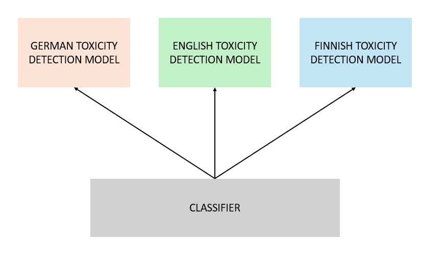
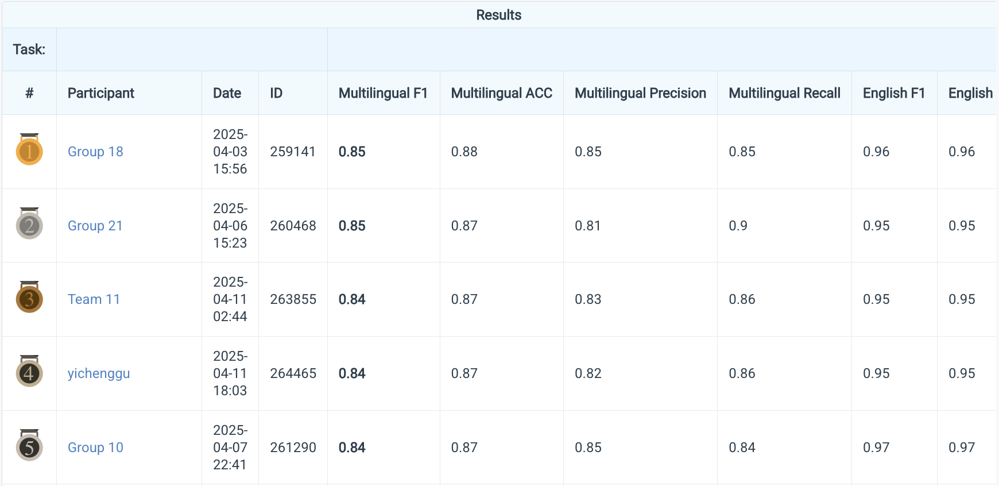

> To keep this repository limited to work I can publish independently, I have removed code contributed by other team members. The full team report is still included for context. The code in this repository therefore contains only my own contributions to the project.

# Multilingual Toxicity Detection — SNLP

Group 21's course project for **ELEC-E5550 — Statistical Natural Language Processing D**, Aalto University (2025). The project explores toxicity classification in **English, German, and Finnish** using an LSTM baseline and transformer models with LoRA fine-tuning.

**Result: 2nd place, with multilingual F1 of 0.85 — less than 1% behind first place.** Both teams' multilingual F1 scores round to 0.85 in the supplied leaderboard.

## TL;DR

The course supplied English training data, but the models had to detect toxicity in English, German, and Finnish. Our team used a language classifier to route each text to a model specialized for its language.

My contribution was the **language classifier and German toxicity detection**. I trained LoRA adapters for a three-class language model and compared three German model/data configurations. The best German experiment reached **0.65 F1**, while the language classifier reached **0.998 F1**.

## Problem setup

Each short text receives a binary label: **toxic or non-toxic**. The challenge is to handle German and Finnish even though the provided training data is English. The team combined a language classifier with three language-specific toxicity models.

The lower stage in the diagram is the **language classifier**. The full pipeline is the team's work; the language classifier and German branch are my contributions.

## What I did

### 1. Trained the language classifier

I fine-tuned `cardiffnlp/twitter-xlm-roberta-base` with LoRA to identify **German, English, or Finnish** from the text. The dataset identifier prefixes supplied the training labels: `ger` → 0, `eng` → 1, and `fin` → 2.

The report describes a balanced development set containing the first 200 examples of each language and final evaluation on the course test set.

| F1 | Accuracy | Precision | Recall |
| ---: | ---: | ---: | ---: |
| 0.998 | 0.998 | 0.996 | 0.997 |

### 2. Prepared German text for training and inference

I filtered course TSV files by the `ger` identifier prefix, removed user mentions and URLs, normalized repeated characters, and trimmed whitespace. In the third German experiment, I also replaced sequences of three or more asterisks with a German offensive word to handle redacted expressions.

Inputs were tokenized to a maximum of **128 tokens**. The dataset wrapper handled missing or empty text by replacing it with a blank space and assigning label 0.

### 3. Compared German models and training data

I ran three experiments, changing the pretrained model and training data while keeping the principal LoRA and training settings the same.

| Experiment | Training data | Base model | F1 | Accuracy | Precision | Recall |
| --- | --- | --- | ---: | ---: | ---: | ---: |
| 1 | First 200 German course development examples | `cardiffnlp/twitter-xlm-roberta-large-2022` | 0.62 | 0.76 | 0.51 | 0.80 |
| 2 | German split of `textdetox/multilingual_toxicity_dataset` | `cardiffnlp/twitter-xlm-roberta-large-2022` | 0.63 | 0.80 | 0.58 | 0.69 |
| 3 | DeTox German dataset | `google-bert/bert-base-german-cased` | **0.65** | **0.80** | 0.56 | 0.76 |

These are the Codabench results reported in Tables 14–16 of the final report. Experiment 3 improved F1 by **3 percentage points** over Experiment 1. Because the data and model both changed, the comparison does not isolate the effect of either change.

### Training configuration

The German models and language classifier used Hugging Face's `Trainer` with the following settings:

| Parameter | Value |
| --- | ---: |
| Maximum token length | 128 |
| LoRA rank | 8 |
| LoRA alpha | 64 |
| LoRA dropout | 0.2 |
| Epochs | 10 |
| Learning rate | 1 × 10⁻⁵ |
| Weight decay | 1 × 10⁻³ |

## Competition results

Group 21 · submission **260468** · **2025-04-06 15:23**.

| Evaluation | F1 | Accuracy | Precision | Recall |
| --- | ---: | ---: | ---: | ---: |
| Multilingual | **0.85** | 0.87 | 0.81 | 0.90 |
| English | 0.95 | 0.95 | 0.94 | 0.97 |
| German | 0.65 | 0.80 | 0.56 | 0.76 |
| Finnish | 0.91 | 0.85 | 0.93 | 0.89 |

## Takeaways

- **Language identification was much easier than toxicity detection:** the language classifier reached 0.998 F1, while the best German toxicity model reached 0.65 F1.
- **German remained the hardest language in the final submission:** its F1 was 0.65, compared with 0.95 for English and 0.91 for Finnish.
- **The strongest German configuration used a German-specific BERT model and DeTox data.** The three experiments show the importance of comparing both model and data choices, rather than relying on one multilingual model.
- **Context remains difficult.** The report identifies culturally specific expressions, sarcasm, and contextual toxicity as challenges for further work.

## Code in this repository

This repository publishes Nguyen Vu Minh's German toxicity-detection code and language classifier. The team's English and Finnish implementations are kept locally and excluded from version control.

- **German:** transformer/LoRA training, preprocessing, and inference experiments.
- **Language classifier:** three-class language identification with a LoRA-adapted multilingual transformer.

| File | Purpose |
| --- | --- |
| `german/training.ipynb` | German model training, evaluation, and submission generation. |
| `german/eng.ipynb` | Transfer experiment using the team's English DeBERTa adapter. |
| `german/DeBERTa_pred.ipynb` | DeBERTa inference with label, probability, and thresholded outputs. |
| `classifier/training.ipynb` | Language classifier training experiment. |
| `utils/process_tsv.py` | German text filtering and preprocessing. |

Course datasets and trained checkpoints are excluded. The notebooks expect local data and adapter files; the transfer experiment also requires the team's English adapter.

## Final report

Read the [full team report](docs/Group_21___Final_Report.pdf) for the methods, experiments, results, and division of labor. My work is described in **Section 3.3 (German toxicity detection)**, **Section 3.5 (language classification)**, and **Appendix C (German preprocessing)**. The report also covers the team's English, Finnish, and LSTM baseline experiments.

## Competition rules

- Classify short texts as **toxic or non-toxic**.
- The provided training data is **English**; development and test data contain **English, German, and Finnish** texts.
- The course data is licensed under a specific agreement and **must not be redistributed**.
- Techniques covered in the course and other approaches are allowed.
- Additional data is allowed if it is **publicly available**.
- Avoid extreme-scale models.
- Methods must be usable in a **Jupyter Notebook with a single GPU**.

## Team and contributions

This is a **team project**.

| Contributor | GitHub | Contribution |
| --- | --- | --- |
| Nguyen Vu Minh | [nguyenvuminhh](https://github.com/nguyenvuminhh) | German toxicity detection and the language classifier. |
| Aapo Eronen | [aapoero](https://github.com/aapoero) | Finnish toxicity detection. |
| Jere Malinen | [proteinbor](https://github.com/proteinbor) | LSTM baseline. |
| Pouya Amiri | [Pouya-Amiri](https://github.com/Pouya-Amiri) | English toxicity detection. |
